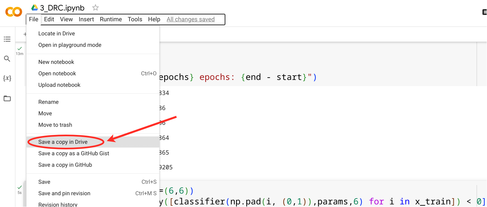

# QML-hands-on
Hands on notebooks and exercises for Quantum Machine Learning.

1. [QML-basics](https://colab.research.google.com/drive/19rhlraaT_YxgvPuNtI6MQjydYtfMZima?usp=sharing)
2. [QML-basics: Exercise solutions](https://colab.research.google.com/drive/1VxXjTMt7abidloR73ec2IuPHEo6JJT60?usp=sharing)
3. [QDNN](https://colab.research.google.com/drive/1epdIdu6wZBJgBd-SW9kxoWSVSZBXkT9D?usp=sharing)
4. [Classical particle images](https://colab.research.google.com/drive/13Pfrs9_rylL1OFu5qJ9xLbWu2jejY5oD?usp=sharing)
5. [DRC](https://colab.research.google.com/drive/1xKiauBa0TT4CTRnEwkF3pdjW41eUAdcf?usp=sharing)

When opening the notebooks in colab make sure to clone them to your own drive:

